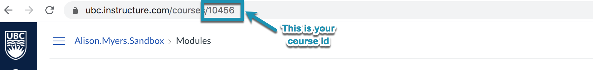
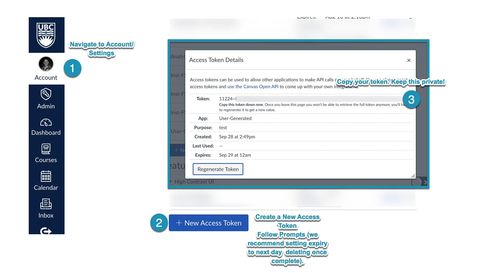
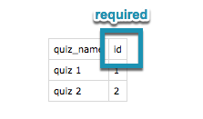
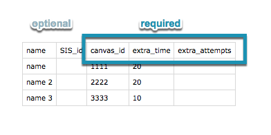

# Quiz Extension
> Detailed instructions with recommendations. 

This script will add extra time and/or extra attempts for Canvas Quizzes based upon two input files: a list of quizzes and a list of students to make these changes for. It has been designed to prompt for required user input.

## **:warning: Important Caveats**
- This script only works with **Canvas Classic Quizzes**
- The attempt and time extensions will be overwritten when you run this script (does not add extra attempts or time, replaces them)
- The script assumes that you want to extend the time and/or attempts for each student for each quiz listed
- We have not tested the behaviour of this script for non-published or past-due quizzes

## Setup

### Get the [Quiz Extension Project](https://github.com/saud-learning-services/quiz-extension-saudls)

- Create a copy of the project on your local machine. 
- We recommend using a directory like Documents/GitHub/

`$ cd Documents/GitHub`

`$ git clone https://github.com/saud-learning-services/quiz-extension-saudls`


### Environment
> You only need to do the set up once. You cannot run the script without following the setup steps. 

1. Install [conda](https://docs.conda.io/projects/conda/en/latest/user-guide/install/) - python version 3+ 
2. This script requires Python modules defined in `environment.yml`, you should create the environment that we suggest and run the script within this environment.
- navigate to your local project (use different path if needed)
`$ cd Documents/GitHub/quiz-extension-saudls` 
`$ conda env create -f environment.yml`


## To Run
### You Will Need

#### 1. Your Canvas Course ID
- navigate to your canvas course
- the `course id` is the integer in the url (*i.e 10456 for the course Alison Myers Sandbox*)



#### 2. A Canvas Token

> :warning::exclamation: **Never share your Canvas Token.** This is your username and password & would allow anyone to access as if they were you. Treat this very carefully.

- navigate to `Account -> Settings`
- scroll to Approved Integrations, and you will see the option to create a New Access Token
- select `+ New Access Token`
  - you will be prompted to `enter a description` and an `expiry date` for your token
      -  :exclamation:*we highly recommend setting the expiry date for only as long as you need the token and returning to delete afterward*
- copy the full token & paste into a text file 
    - :exclamation:*we do not recommend saving the file*
    - :exclamation:*we recommend removing the token as soon as you are done the process*



#### 3. Quiz Input & Student Input
- Your input should indicate what you want to change. If you do not want a change to be made for a course or a student - **remove them from the files**. 
- The input files should be in the project directory in `input`.

- When you run the script you will be given the option of creating a student list and a quiz list, these can be edited and act as the input. However, if you know the courses and quizzes, you can create your own.

- The following examples include "optional" fields which are included when you choose to generate them when you run the script. 
  - No extra_time or extra_attempts are assumed when the script creates your files. 


`input/quiz_input.csv`



`input/student_input.csv`


### To Run

In terminal
1. navigate to the project directory (*setup recommends Documents/GitHub/ as YOUR_PATH*)
`$ cd /YOUR_PATH/quiz-extension-saudls`
2. launch the environment
`$ conda activate quiz_extension`
3. run the script
`$ python extend_quiz.py`

### Follow the Prompts & Confirmations in Terminal
**Course Information**
- You will be asked for your canvas url (note, ubc.test is for the test environment)
```
https://ubc.instructure.com/
https://ubc.test.instructure.com/
```

- You will be asked to input your canvas token
- You will be asked to input your course id 


**Quiz and Student Information**

- You will be asked if you want to generate the quiz_input file
- You will be asked if you want to generate the student_input file 

  - If you choose to not create these files then you should have your input files ready in `input`:
    ```
    quiz_input.csv
    student_input.csv
    ```
 
  - If you choose to create these files:
    - The inital files are found in `input` and are called
    ```
    input-all_course_quizzes.csv
    input-all_course_students.csv
    ```
    - make any changes to the files (remove quizzes, remove students, add extensions as necessary)
    - save the updated files in the `input` folder as
    ```
    quiz_input.csv
    student_input.csv
    ```


**Confirmation**

You will be asked to confirm the data that will be changed. If you need to make a change to the files - you can do so. Make the changes, save, and select N until you have what you want.

> :warning: Once you confirm to make the changes you cannot easily undo them! They will be automatically applied. 

**Review**
You will see any errors in the terminal, and can review these errors in the generated log file (`src/log/`).
